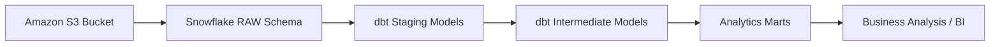
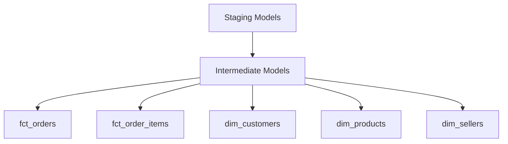
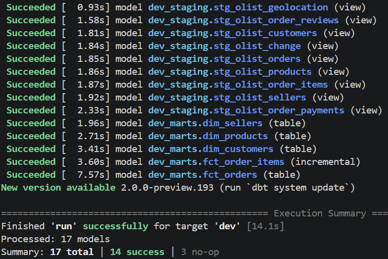
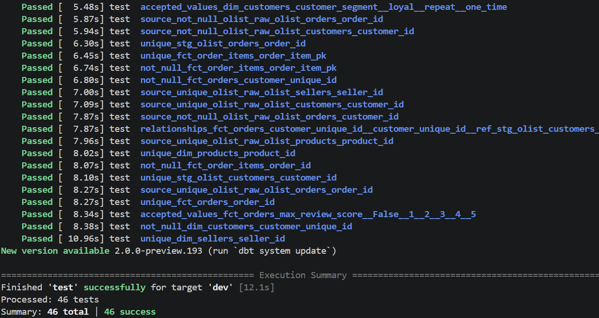

# Olist Analytics dbt Project


## Présentation

Ce projet construit un entrepôt analytique e-commerce à partir des données brutes du marketplace brésilien Olist.

Les données sources sont stockées dans un bucket Amazon S3, puis ingérées dans Snowflake dans un schéma `RAW` avant d’être transformées avec dbt en modèles analytiques propres, testés et exploitables.

L’objectif est de transformer des données opérationnelles brutes en modèles fiables pour l’analyse business : commandes, clients, vendeurs, produits, paiements, avis, performance de livraison, taux de change et chiffre d’affaires en BRL/EUR.

Le projet suit les bonnes pratiques d’Analytics Engineering avec dbt, Snowflake, une architecture en couches, des modèles SQL modulaires, des macros réutilisables et des tests de qualité automatisés.

## Sommaire

- [Contexte Business](#contexte-business)
- [Stack Technique](#stack-technique)
- [Architecture](#architecture)
- [Ingestion des Données](#ingestion-des-données)
- [Modèle de Données](#modèle-de-données)
- [Questions Business](#questions-business)
- [Macros](#macros)
- [Stratégie de Tests](#stratégie-de-tests)
- [Résultats de Validation](#résultats-de-validation)
- [Insights Business](#insights-business)
- [Structure du Projet](#structure-du-projet)
- [Apprentissages](#apprentissages)
- [Améliorations Futures](#améliorations-futures)

## Contexte Business

Olist est une marketplace brésilienne qui connecte des vendeurs à des clients à travers le Brésil.

Ce projet simule un pipeline Analytics Engineering réaliste pour une entreprise e-commerce. Les données brutes sont chargées depuis un bucket S3 vers Snowflake, puis transformées en tables analytiques fiables permettant de suivre :

- la performance des commandes ;
- le comportement client ;
- la contribution des vendeurs ;
- la performance des catégories produits ;
- les délais de livraison ;
- les moyens de paiement ;
- les scores d’avis ;
- le chiffre d’affaires en BRL et en EUR.

## Stack Technique

- Amazon S3 pour le stockage des fichiers sources
- Snowflake pour le data warehouse
- dbt Fusion pour la transformation SQL
- SQL pour la modélisation analytique
- dbt tests pour la qualité de données
- dbt macros pour la logique réutilisable
- Modélisation dimensionnelle
- Bonnes pratiques Analytics Engineering

## Architecture



## Ingestion des Données

Les fichiers sources du dataset Olist sont stockés dans un bucket Amazon S3. Snowflake charge ces fichiers dans le schéma `RAW` à l’aide d’un stage externe et de commandes `COPY INTO`.

Le schéma `RAW` contient les tables brutes suivantes :

- `OLIST_ORDERS`
- `OLIST_CUSTOMERS`
- `OLIST_ORDER_ITEMS`
- `OLIST_ORDER_PAYMENTS`
- `OLIST_ORDER_REVIEWS`
- `OLIST_PRODUCTS`
- `OLIST_SELLERS`
- `OLIST_GEOLOCATION`
- `OLIST_CHANGE`

La table `OLIST_CHANGE` contient des taux de change historiques EUR/BRL utilisés pour convertir le chiffre d’affaires de BRL vers EUR.


## Modèle de Données

Le projet est organisé en trois couches dbt : `staging`, `intermediate` et `marts`.

### Staging

Les modèles staging standardisent les données brutes :

- renommage des colonnes ;
- nettoyage des identifiants ;
- conversion des dates ;
- typage des colonnes numériques ;
- normalisation des textes, villes et États.

Exemples de modèles staging :

- `stg_olist_orders`
- `stg_olist_customers`
- `stg_olist_order_items`
- `stg_olist_order_reviews`
- `stg_olist_change`

### Intermediate

Les modèles intermédiaires préparent la logique métier réutilisable :

- agrégation des paiements ;
- enrichissement des commandes ;
- jointure des produits, vendeurs et catégories ;
- préparation des indicateurs de livraison.

Exemples de modèles intermédiaires :

- `int_orders_enriched`
- `int_order_items_joined`
- `int_payments_aggregated`

### Marts

Les marts exposent les tables finales destinées à l’analyse business.

#### Tables de faits

- `fct_orders` : une ligne par commande, avec paiement, livraison, avis et conversion EUR.
- `fct_order_items` : une ligne par article de commande, avec produit, vendeur, prix et frais de livraison.

#### Tables de dimensions

- `dim_customers` : informations clients et segmentation.
- `dim_products` : informations produits et catégories.
- `dim_sellers` : informations vendeurs et localisation.



## Questions Business

Ce modèle analytique permet de répondre à des questions e-commerce concrètes :

- Quel est le chiffre d’affaires total en BRL et en EUR ?
- Quel est le panier moyen par commande ?
- Quels vendeurs génèrent le plus de revenus ?
- Quelles catégories produits performent le mieux ?
- Quels États clients concentrent le plus de commandes ?
- Quel est le délai moyen de livraison ?
- Combien de commandes sont livrées en retard ?
- Existe-t-il une relation entre retard de livraison et score d’avis ?
- Quels clients passent plusieurs commandes ?
- Quels moyens de paiement sont les plus utilisés ?

## Macros

Le projet utilise des macros dbt pour centraliser de la logique SQL réutilisable.

### `clean_id`

La macro `clean_id` nettoie les identifiants bruts importés depuis les fichiers sources.

```sql

    NULLIF(TRIM(REPLACE({{ column_name }}, '"', '')), '')

```

Exemple d’utilisation :

```sql
{{ clean_id('order_id') }} AS order_id
```

Cette macro permet de supprimer les guillemets parasites, les espaces inutiles et de convertir les chaînes vides en `NULL`.

### `brl_to_eur`

La macro `brl_to_eur` convertit un montant en BRL vers EUR à partir du taux EUR/BRL historique.

```sql

    ({{ amount_brl }}) / NULLIF({{ eur_brl_rate }}, 0)

```

Exemple d’utilisation :

```sql
{{ brl_to_eur('orders.total_paid', 'exchange.eur_brl_avg_rate') }} AS total_paid_eur
```

## Stratégie de Tests

Le projet utilise des tests dbt pour contrôler la qualité des données et la fiabilité des modèles.

Tests utilisés :

- `not_null` : vérifie qu’une colonne clé ne contient pas de valeur nulle.
- `unique` : vérifie l’unicité des identifiants.
- `relationships` : vérifie l’intégrité référentielle entre modèles.
- `accepted_values` : vérifie que les valeurs appartiennent à une liste autorisée.
- test personnalisé : vérifie qu’une commande ne peut pas être livrée avant sa date d’achat.

Exemple de règle métier personnalisée :

```sql
delivered_to_customer_at >= ordered_at
```

## Résultats de Validation

Le pipeline dbt a été exécuté avec succès.

### dbt run

```text
Finished 'run' successfully for target 'dev'
Processed: 17 models
Summary: 17 total | 14 success | 3 no-op
```



### dbt test

```text
Finished 'test' successfully for target 'dev'
Processed: 46 tests
Summary: 46 total | 46 success
```



Ces résultats indiquent que les modèles dbt se construisent correctement et que les contrôles de qualité définis passent avec succès.

## Insights Business

Les modèles finaux permettent de suivre plusieurs indicateurs clés.

### Indicateurs commandes

- nombre total de commandes ;
- chiffre d’affaires total ;
- panier moyen ;
- statut des commandes ;
- taux de livraison en retard.

### Indicateurs clients

- nombre de clients uniques ;
- clients récurrents ;
- segmentation client ;
- répartition géographique.

### Indicateurs vendeurs

- chiffre d’affaires par vendeur ;
- nombre de commandes par vendeur ;
- performance par État vendeur.

### Indicateurs produits

- catégories les plus vendues ;
- revenus par catégorie ;
- contribution des produits aux ventes.

### Indicateurs livraison

- délai moyen de livraison ;
- écart entre livraison estimée et livraison réelle ;
- impact potentiel du retard sur les avis clients.


## Structure du Projet

```text
olist_analytics/
├── analyses/
├── macros/
│   ├── brl_to_eur.sql
│   └── clean_id.sql
├── models/
│   ├── staging/
│   │   ├── _olist_sources.yml
│   │   ├── _olist_models.yml
│   │   ├── stg_olist_orders.sql
│   │   ├── stg_olist_customers.sql
│   │   ├── stg_olist_order_items.sql
│   │   ├── stg_olist_order_payments.sql
│   │   ├── stg_olist_order_reviews.sql
│   │   ├── stg_olist_products.sql
│   │   ├── stg_olist_sellers.sql
│   │   ├── stg_olist_geolocation.sql
│   │   └── stg_olist_change.sql
│   ├── intermediate/
│   │   ├── int_orders_enriched.sql
│   │   ├── int_order_items_joined.sql
│   │   └── int_payments_aggregated.sql
│   └── marts/
│       ├── _marts_models.yml
│       ├── fct_orders.sql
│       ├── fct_order_items.sql
│       ├── dim_customers.sql
│       ├── dim_products.sql
│       └── dim_sellers.sql
├── seeds/
├── snapshots/
├── tests/
│   └── asset_delivery_after_order.sql
├── dbt_project.yml
├── packages.yml
└── README.md
```

## Apprentissages

Ce projet m’a permis de mettre en pratique plusieurs compétences clés d’Analytics Engineering :

- concevoir une architecture analytique en couches ;
- ingérer des données depuis S3 vers Snowflake ;
- transformer des données brutes avec dbt ;
- construire des modèles staging, intermediate et marts ;
- appliquer une modélisation orientée analyse ;
- écrire des tests de qualité de données ;
- créer des macros dbt réutilisables ;
- gérer des conversions de devise avec des taux historiques ;
- documenter un projet data de manière professionnelle.

## Améliorations Futures

Améliorations possibles du projet :

- ajouter une exposition BI avec Power BI, Tableau ou Streamlit ;
- créer un dashboard e-commerce avec les principaux KPI ;
- ajouter des snapshots dbt pour suivre l’évolution de certaines dimensions ;
- enrichir les tests métier ;
- ajouter une documentation dbt plus détaillée sur chaque modèle ;
- automatiser l’exécution du pipeline avec dbt Cloud ou GitHub Actions ;
- ajouter des sources freshness checks ;
- intégrer une table calendrier ;
- améliorer la gestion des taux de change manquants ;
- ajouter une couche d’analyse par cohortes clients.

## Statut du Projet

Le projet est fonctionnel.

- `dbt run` : succès
- `dbt test` : succès
- 17 modèles traités
- 46 tests exécutés avec succès
